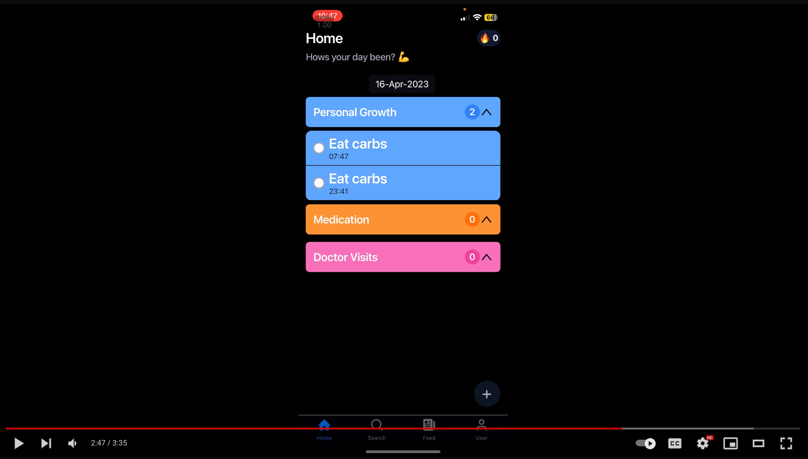

## Here's a [Notion Page](https://glory-menu-212.notion.site/EverHealth-0eddd73c47c04d939d7416de819362e0) explaining all about the app
 

# Brief Summary

- Developed a mobile app that motivates patients to adhere to treatment plans and manage chronic conditions through the use of gamification techniques. Built using Expo, React Native, firebase, GPT-4.

- Added a streak & level system to encourage users to complete daily tasks related to personal growth, medication.

- Incorporated an AI doctor assistant customised to the user, powered by GPT-4, as well as a leaderboard, dark mode, and RSS feeds to provide users with a comprehensive and engaging experience.

## Tech Stack used

- Expo, React Native
- Typescript, Tailwind
- Firebase
- GPT-4
- Zustand, zod, reack-hook-form

## To run the app on your device

- Install Expo Go from Play Store/ App Store
- Open the [Link](https://expo.dev/@vishnu_v12/gfg-hackathon?serviceType=classic&distribution=expo-go)
- Click on "Open in Expo Go"
